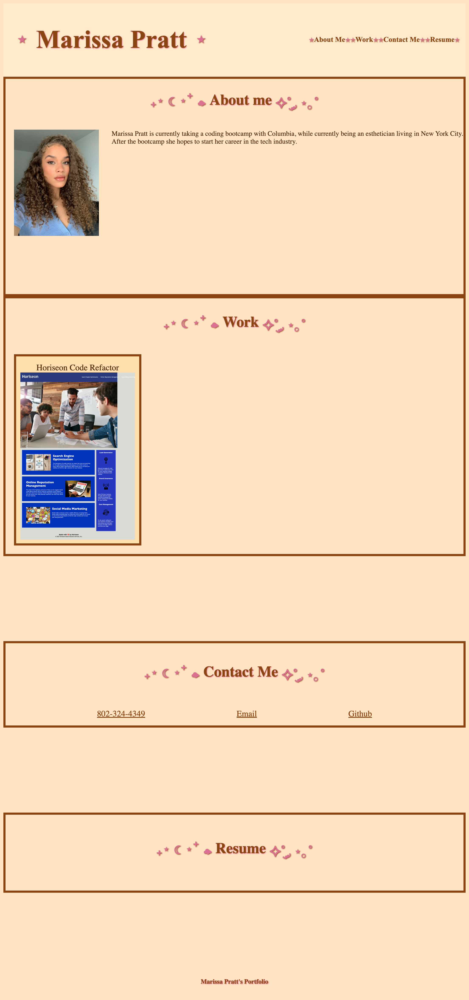

# my-portfolio

## Desciption
My goal was to create a portfolio to showcase my work, contact information and share things about myself. I created this website to show to protential employeers so they can see my work, resume, and personal information about me. During this challenge I learned how to build an HTML and CSS stylesheet from scratch for the first time.

## Installation 
 Going into this challenge the fist thing I did was write out my HTML layout the was I
 believed it need to be to meet all criteria. Next I created my CSS stylesheet, with this I made sure to have a general idea of how I wanted the page to look and the color combination I wanted to add and decorative symbols I wanted to add to decorate the page. Once I decided on the details I made the css stylsheet starting with the title being my name and the nav bar that had a text-shadow when it was hovered over. In the work section I made sure that the screenshot of the deploy application to the first challenge was linked with the image and that the image had a title and a border box that had a box-shaow with the mouse hovered over it so people knew it could be clicked on and the link would take you to the deployed application. After that was done I added my contact information and made sure that all links worked and the contact list displayed inline and the color matched the rest of the website and when you hover over the contacts the text-shadow would appear. Lastly I added the the media screen when so that on a laptop the screen stays as is, once it goes down to an ipad screen the title and nav bar text color and shadow changed to oposite as original, and when on an phone screen the body and header background color changed to a light greean color and the border around each section changed to pink and the frame and headed for the horiseon code refacter also changed to be pink with the brown shadow.

 Deployed application link: https://heeyitsrissa.github.io/my-portfolio/

 screenshot of deployed application: 

 ## License 

